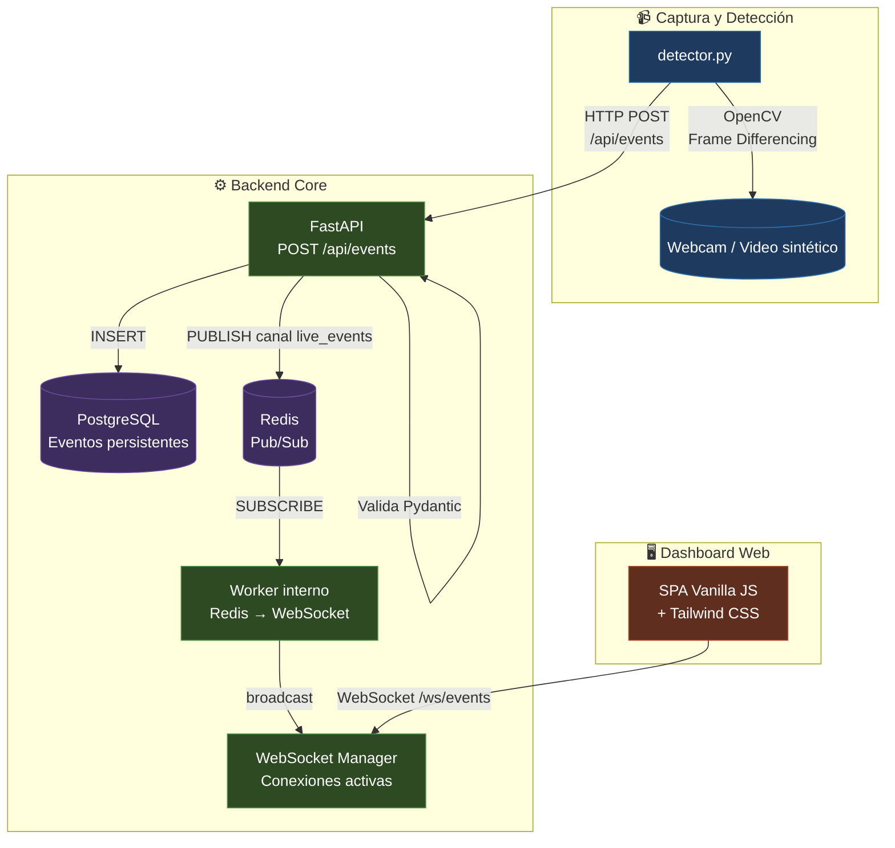
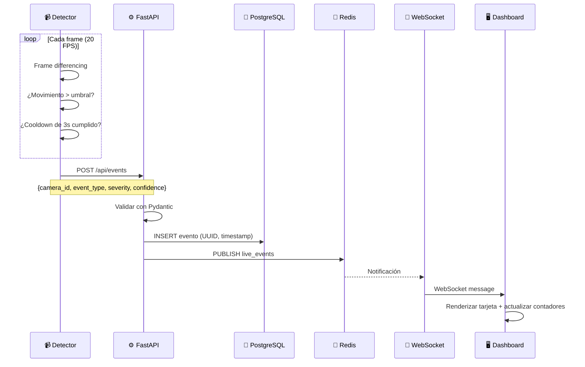

# 🛡️ Guardian Live Monitor


**Plataforma de monitoreo de seguridad crítica en tiempo real.** Captura flujos de video locales, detecta eventos de movimiento mediante visión computacional, procesa alertas con baja latencia y las distribuye instantáneamente a un panel de control web sin necesidad de recargar la página.

---

## 📊 Diagrama de Arquitectura



### Flujo de Datos



---

## 🚀 Inicio Rápido

### Requisitos

- [Docker](https://docs.docker.com/get-docker/) (v24+)
- [Docker Compose](https://docs.docker.com/compose/install/) (v2.20+)

### Despliegue

```bash
# 1. Clonar el repositorio
git clone https://github.com/devcristianlopez/guardian-live-monitor.git
cd guardian-live-monitor

# 2. Configurar variables de entorno (o usar defaults)
cp .env.example .env

# 3. ¡Levantar todo!
docker compose up --build
```

### Acceso

| Servicio | URL |
|----------|-----|
| **Dashboard Web** | [http://localhost](http://localhost) |
| **API Backend** | [http://localhost:8000](http://localhost:8000) |
| **Documentación API** | [http://localhost:8000/docs](http://localhost:8000/docs) |

---

## 🧩 Estructura del Proyecto

```
guardian-live-monitor/
├── docker-compose.yml          # Orquestación de servicios
├── .env.example                # Plantilla de configuración
├── .gitignore
│
├── backend/                    # FastAPI + PostgreSQL + Redis + WebSockets
│   ├── Dockerfile
│   ├── requirements.txt
│   └── app/
│       ├── main.py             # App principal, startup/shutdown, WebSocket
│       ├── config.py           # Configuración centralizada (pydantic-settings)
│       ├── models.py           # Modelos Pydantic (EventPayload)
│       ├── database.py         # Conexión async a PostgreSQL (SQLAlchemy 2.0)
│       ├── schemas.py          # Modelo ORM Event
│       ├── redis_client.py     # Cliente Redis Pub/Sub
│       ├── ws_manager.py       # Gestor de conexiones WebSocket
│       └── routers/
│           └── events.py       # POST /api/events
│
├── detector/                   # OpenCV - Detección de movimiento
│   ├── Dockerfile
│   ├── requirements.txt
│   └── detector.py             # Captura + frame differencing + eventos
│
└── dashboard/                  # SPA - Panel de control
    ├── Dockerfile
    ├── nginx.conf
    └── public/
        ├── index.html          # UI con Tailwind CSS
        └── app.js              # WebSocket + lógica en tiempo real
```

---

## ⚙️ Configuración

### Variables de Entorno

| Variable | Default | Descripción |
|----------|---------|-------------|
| `POSTGRES_USER` | `guardian` | Usuario de PostgreSQL |
| `POSTGRES_PASSWORD` | `guardian_pass` | Contraseña de PostgreSQL |
| `POSTGRES_DB` | `guardian_monitor` | Nombre de la base de datos |
| `DATABASE_URL` | `postgresql+asyncpg://...` | URL de conexión a PostgreSQL |
| `REDIS_URL` | `redis://redis:6379/0` | URL de conexión a Redis |
| `BACKEND_URL` | `http://backend:8000` | URL del backend (para el detector) |
| `CAMERA_ID` | `CAM-01` | Identificador de la cámara |
| `SOURCE` | `video` | Fuente de video: `webcam` o `video` |
| `VIDEO_PATH` | `/app/test_video.mp4` | Ruta al archivo de video de prueba |
| `MOTION_THRESHOLD` | `5000` | Píxeles mínimos para considerar movimiento |
| `COOLDOWN_SECONDS` | `3` | Segundos entre eventos consecutivos |

### Modos de Funcionamiento

**🔴 Modo Webcam (producción):**
```env
SOURCE=webcam
```

**🎬 Modo Video de Prueba (demo):**
```env
SOURCE=video
```
El detector genera automáticamente un video sintético con movimiento simulado si no encuentra el archivo. Ideal para demostraciones sin cámara.

---

## 📡 API REST

### `POST /api/events`

Ingesta de eventos de detección.

**Request:**
```json
{
  "camera_id": "CAM-01",
  "event_type": "motion_detected",
  "severity": "high",
  "confidence": 0.89
}
```

**Response (201 Created):**
```json
{
  "id": "uuid",
  "camera_id": "CAM-01",
  "event_type": "motion_detected",
  "severity": "high",
  "confidence": 0.89,
  "timestamp": "2026-06-14T12:34:56.789012+00:00"
}
```

**Validaciones:**
- `confidence`: número entre 0.0 y 1.0
- `severity`: solo `low`, `medium` o `high`

### `WS /ws/events`

Conexión WebSocket para recibir eventos en tiempo real. El servidor envía eventos JSON a todos los clientes conectados inmediatamente después de ser procesados.

---

## 🧠 ¿Cómo Funciona?

### 1. Detección de Movimiento (`detector.py`)

El detector ejecuta un bucle continuo que:
1. Captura frames desde la fuente de video (webcam o archivo)
2. Convierte a escala de grises y aplica desenfoque Gaussiano
3. Calcula la **diferencia absoluta** entre el frame actual y el anterior
4. Aplica un **threshold binario** para identificar píxeles cambiados
5. Dilata la imagen para llenar huecos en las regiones de movimiento
6. Cuenta los píxeles no-cero como métrica de movimiento
7. Si supera el umbral configurado y respeta el cooldown de 3s, envía un evento

La **severidad** se calcula dinámicamente según el nivel de confianza:
| Confianza | Severidad |
|-----------|-----------|
| < 30% | `low` (verde) |
| 30% – 70% | `medium` (amarillo) |
| > 70% | `high` (rojo) |

### 2. Procesamiento Backend (`backend/app/`)

1. **FastAPI** recibe el `POST /api/events`
2. **Pydantic** valida la estructura del payload
3. **SQLAlchemy 2.0** (asíncrono) inserta el evento en **PostgreSQL**
4. **Redis** publica el evento en el canal `live_events`
5. Un **worker asíncrono** escucha el canal de Redis y retransmite a todos los WebSocket conectados

### 3. Dashboard en Tiempo Real (`dashboard/public/`)

1. Al cargar la página, se conecta automáticamente al WebSocket
2. Cuando recibe un evento, lo inserta al inicio del feed con una **animación slideIn**
3. Actualiza los contadores de analítica (total alertas, última severidad)
4. Implementa **reconexión automática** con backoff exponencial (1s → 30s)
5. Límite de 100 eventos en pantalla para gestión de memoria

---

## 🛠️ Stack Tecnológico

| Componente | Tecnología | Propósito |
|------------|-----------|-----------|
| **Lenguaje** | Python 3.12 | Backend y detector |
| **API** | FastAPI | Framework asíncrono con soporte WebSocket nativo |
| **Base de Datos** | PostgreSQL 16 | Persistencia de eventos con timestamps precisos |
| **Cache/Mensajería** | Redis 7 | Pub/Sub para distribución en tiempo real |
| **Visión** | OpenCV | Captura de video y frame differencing |
| **Frontend** | HTML5 + Vanilla JS + Tailwind CSS | SPA sin dependencias ni build step |
| **Servidor Web** | Nginx | Servir archivos estáticos del dashboard |
| **Infraestructura** | Docker Compose | Despliegue reproducible con un solo comando |

---

## 📐 Decisiones Técnicas (ADRs)

| Decisión | Descripción |
|----------|-------------|
| **FastAPI + Async** | Backend asíncrono con soporte nativo de WebSocket y async/await |
| **PostgreSQL** | Base de datos relacional madura con precisión de timestamps con timezone |
| **Redis Pub/Sub** | Broker de mensajería simple y de baja latencia para distribución en tiempo real |
| **Frame Differencing** | Algoritmo de detección simple y eficiente, ideal para fondos estáticos |
| **Vanilla JS** | SPA sin frameworks ni build step, máximo rendimiento y mínimo peso |
| **Docker Compose** | Infraestructura reproducible, desacoplada y de un solo comando |

---

## 🔮 Próximos Pasos (Post-MVP)

- [ ] Autenticación de usuarios y roles
- [ ] Histórico persistente de eventos con búsqueda y filtros
- [ ] Múltiples cámaras simultáneas con selector en dashboard
- [ ] Almacenamiento de snapshots/screenshots en eventos
- [ ] Notificaciones push y por email
- [ ] Tests automatizados (unitarios + integración)
- [ ] Despliegue en cloud con HTTPS y dominio personalizado
- [ ] Pipeline CI/CD con GitHub Actions

---

## 📄 Licencia

MIT License — ver archivo [LICENSE](LICENSE) para más detalles.

---

<div align="center">
  <sub>Built with ❤️ by Cristian Lopez</sub>
  <br/>
  <sub>MVP Demo — Junio 2026</sub>
</div>
